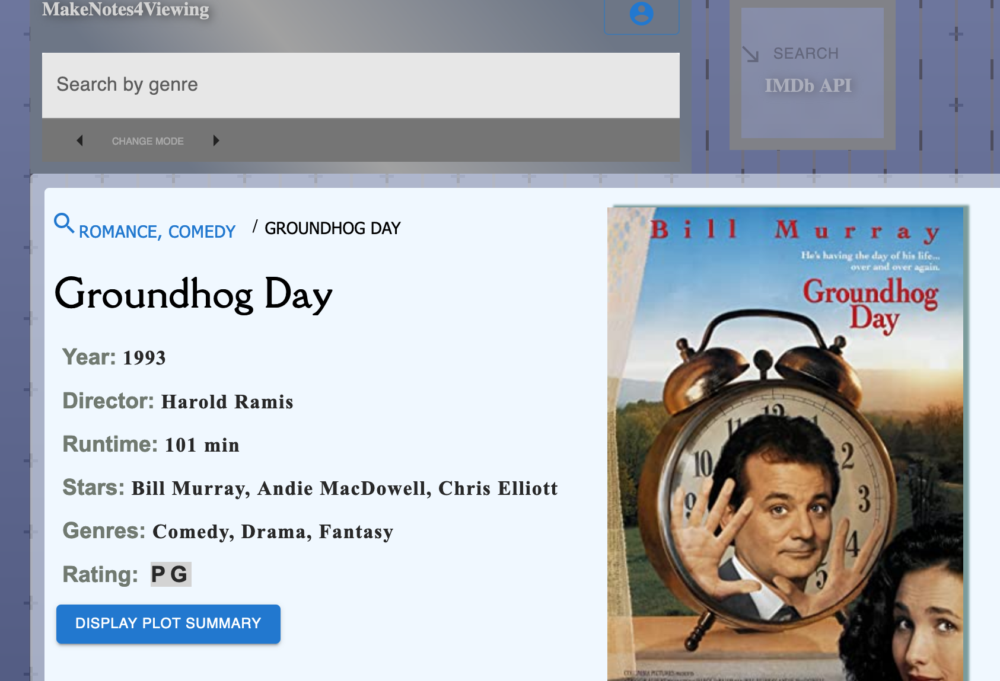

# make-notes-4-viewing
With this app, unravel a variety of examples of TV shows, movies, and their associated details. Search by title, by genre(s), or most popular TV/film. Signup/login using the profile icon to enable saving bookmarks to your account.

# References of tools used
React.js, Python, Flask, imdb API, omdb API, Material UI, SQLAlchemy, PyMySQL

# Deployed link
<a href='https://makenotes4viewing-f4b5c41e614e.herokuapp.com/'>Heroku link</a>

# Screenshot

